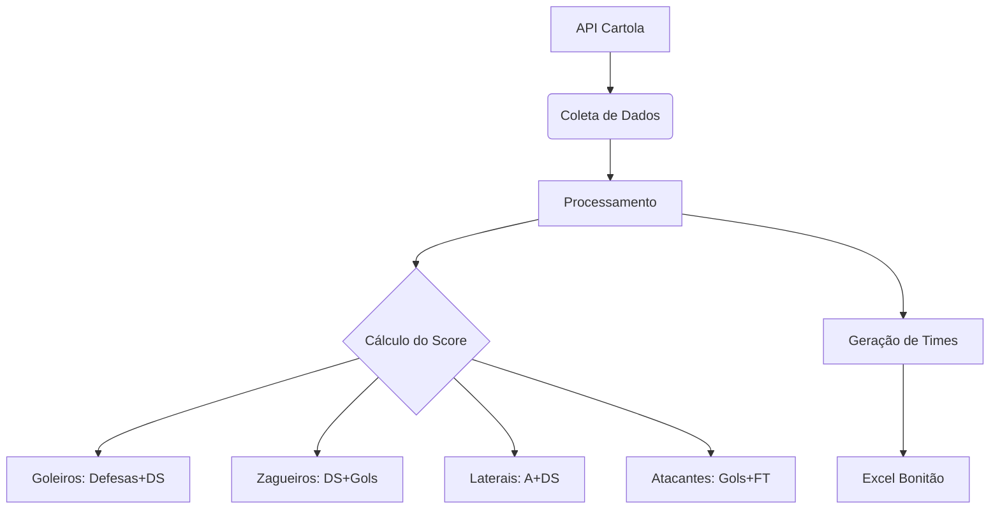

# IA de Recomendação para Cartola FC ⚽📊


## 📌 Visão Geral
Inteligência Artificial que analisa dados oficiais do Cartola FC para montar **times otimizados** considerando:
- ✅ Desempenho histórico
- 📈 Potencial de valorização
- 💰 Restrições de orçamento
- 🧠 Peso estratégico por posição

## 🚀 Como Funciona?


# Clone o repositório
git clone https://github.com/seuuser/ia-cartola.git

# Instale as dependências
pip install -r requirements.txt

# Execute o programa
python ia_cartola.py

# 🎯 Estratégias Disponíveis
 |Estratégia	|🔍 Foco Principal	|⚖️ Peso Score	|📈 Peso Valorização|
 |----------|-------|-------------|-------------|
 |Pontuação	|Performance consistente	|70%	|30%|
 |Valorização	|Ganho de cartoletas	|30%	|70%|
 |Equilibrado	|Melhor custo-benefício	|50%	|50%|
 
# 📊 Métricas Analisadas

```python
metrics = {
    "Ofensivas": ["Gols (G)", "Assistências (A)", "Finalizações (FT/FF/FD)"],
    "Defensivas": ["Desarmes (DS)", "Defesas (DE)", "Faltas (FC)"],
    "Financeiras": ["Preço", "Variação %", "Mínimo p/ valorizar"],
    "Performance": ["Média", "Última Pontuação", "Status"]
}
```

# 📂 Saída Gerada
Arquivo Excel (times_recomendados.xlsx) com:

- 📋 Lista completa de jogadores

- 📊 Estatísticas comparativas

- 🎨 Formatação condicional (cores por status)

Relatório no Terminal com:

⭐ **Time 1** - Custo: C$ 125.00 (Saldo: C$ 25.00)  
├── Média Esperada: 82.5 pts  
├── Valorização: +15.3%  
└── Capitão: Pedro (9.2 pts)

# 🛠️ Personalização Avançada
Edite o arquivo config.json para:
``` json
{
  "pesos_posicoes": {
    "Goleiro": {"media": 0.7, "defesas": 0.3},
    "Atacante": {"media": 0.6, "gols": 0.4}
  },
  "limites": {
    "max_tentativas": 1000,
    "jogadores_por_posicao": 30
  }
}
```
# 🤔 FAQ
Q: Posso usar em dispositivos móveis?
✅ Sim, via Termux (Android) ou servidor remoto

Q: Quantos times posso gerar?
📊 Até 10 times simultâneos

Q: Os dados são atualizados automaticamente?
🔄 Sim, toda execução busca dados novos da API

#📜 Licença
MIT License - Livre para uso e modificação

Feito com ❤️ por Daniel Mendes - Contribuições são bem-vindas! 🚀


